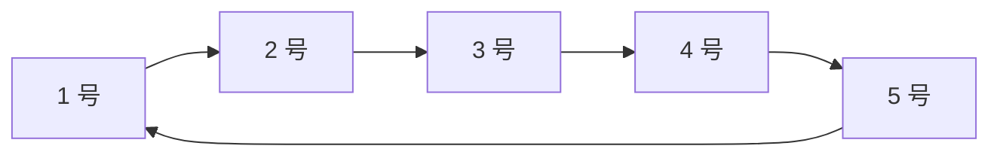
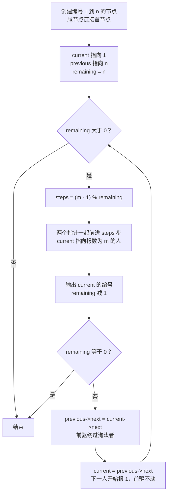
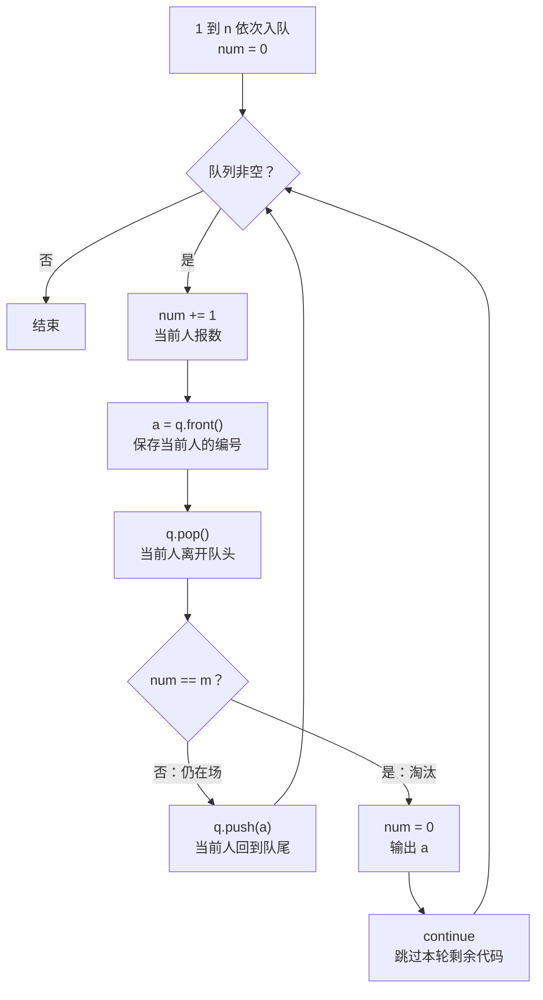

# P1996 约瑟夫问题：循环链表解法

学习日期：2026-10-11。

本题用循环链表保存仍在场的人，每轮找到报数为 `m` 的节点，输出编号，再修改前驱的 `next` 将它摘出环。本文也保留队列重构时的流程图，解释为什么淘汰者不会被 `q.push(a)` 再次插入。

配套源码：[C 循环链表实现](../P1996_linked_list.c)。其他资料：[链表与队列概念及视频](../链表与队列题解.md)、[数组模拟错题记录](../README.md)、[C 循环队列实现](../P1996_queue.c)。

## 1. 题意与输入输出

[洛谷 P1996 约瑟夫问题](https://www.luogu.com.cn/problem/P1996)：`n` 个人按编号 `1..n` 围成一圈，从 1 号开始报数，报到 `m` 的人出圈，下一人重新从 1 报数，输出所有人的出圈顺序。

输入先是人数 `n`，再是报数上限 `m`。即使只剩一人，也要输出他的编号。

```text
输入：5 3
输出：3 1 5 2 4
```

## 2. 什么是循环链表

一个节点保存两项内容：人的编号，以及下一人的地址。

```c
typedef struct Node {
    int id;
    struct Node *next;
} Node;
```

- `id`：当前节点代表哪个人。
- `next`：指向下一个节点的指针。
- `Node`：结构体类型的别名。
- `Node *current`：保存节点地址的指针。
- `current->id`：访问指针所指节点的编号，等价于 `(*current).id`。
- `&nodes[i]`：取得第 i 个节点的地址。

普通单链表的尾节点指向 `NULL`。循环单链表的尾节点指向首节点，因此走到最后一人后可以自然回到第一人。



节点不要求在内存中相邻。本实现用一个数组提供节点存储，但实际遍历顺序由节点里的 `next` 指针决定，仍然是循环链表。

## 3. 两个指针分别做什么

| 变量 | 含义 | 初始状态 |
| --- | --- | --- |
| `current` | 本轮从这里开始报 1；移动后指向待淘汰者 | 指向 1 号 |
| `previous` | `current` 的前驱，删除时负责改链接 | 指向 n 号 |
| `remaining` | 剩余人数 | n |

只要还有人在场，就保持 `previous->next == current`。前进时两个指针一起走：

```c
previous = current;
current = current->next;
```

起点已经报 1，所以找到报数为 m 的人需要前进 **m-1 步**，不是 m 步。剩 r 人时，完整走 r 步会回到原来的位置，可以省掉整圈：

```c
int steps = (m - 1) % remaining;
```

例如 `n=5、m=3`：从 1 号起步，走到 2 号，再走到 3 号，共走两步，此时 `previous` 指向 2，`current` 指向 3。

## 4. 怎样删除一个人，为什么不会再次经过他

```text
删除前：2 → 3 → 4
       前驱 当前 下一人

删除后：2 ────→ 4
```

核心操作：

```c
previous->next = current->next; // 让前驱直接连接下一人。
current = previous->next;      // 下一人重新报 1。
```

删除 3 号以后，2 号的 `next` 已经指向 4 号。以后沿 `next` 遍历就会从 2 号直接到 4 号，不会再走到 3 号。

`previous` 此时仍指向 2 号，不必再前进：2 号正好也是新 `current`（4 号）的前驱。如果再移动一次，就破坏了前驱关系。

本实现没有调用 `malloc`，因此删除只是摘掉链接，不调用 `free`。被摘掉的数组节点仍有存储，但不再属于在场人员构成的环。最后一人输出后直接结束，不再尝试维护一个空环。



## 5. 样例逐轮推演

下面的“剩余环”从下一轮起点开始列出，最后一个元素会连接回第一个。

| 轮次 | 本轮起点 | 移动次数 `(m-1)%remaining` | 出圈者 | 剩余环 |
| --- | --- | --- | --- | --- |
| 1 | 1 | 2 | 3 | 4 → 5 → 1 → 2 |
| 2 | 4 | 2 | 1 | 2 → 4 → 5 |
| 3 | 2 | 2 | 5 | 2 → 4 |
| 4 | 2 | 0 | 2 | 4 |
| 5 | 4 | 0 | 4 | 空 |

第四轮只剩两人，`(3-1)%2=0`。这相当于报数绕了完整一圈，当前 2 号仍然是第三个报数的人，因此直接淘汰他是正确的。

## 6. 带注释的完整 C 代码

以下代码与 [P1996_linked_list.c](../P1996_linked_list.c) 一致，使用 C99 变长数组准备节点：

```c
#include <stdio.h>

// 一个节点代表一个人：保存编号和“下一位仍在场的人”的地址。
typedef struct Node {
    int id;
    struct Node *next;
} Node;

int main(void) {
    int n, m;
    if (scanf("%d %d", &n, &m) != 2 || n <= 0 || m <= 0) {
        return 0;
    }

    // 用 C99 变长数组一次准备所有节点，重点练习链接与删除。
    // 节点存在数组里，但遍历顺序由 next 决定，是循环链表。
    // 没有调用 malloc，因此不需要 free；出圈只是从链上摘掉。
    Node nodes[n];
    for (int i = 0; i < n; i++) {
        nodes[i].id = i + 1;
        nodes[i].next = &nodes[(i + 1) % n];
    }

    Node *current = &nodes[0];    // 本轮从此人开始，他报 1。
    Node *previous = &nodes[n - 1]; // current 的前驱，方便删除。
    int remaining = n;

    while (remaining > 0) {
        // 起点已算第 1 人，只需前进 m-1 次。
        // 完整一圈不改变位置，所以取模跳过整圈。
        int steps = (m - 1) % remaining;
        for (int i = 0; i < steps; i++) {
            previous = current;
            current = current->next;
        }

        printf("%d%c", current->id, remaining == 1 ? '\n' : ' ');
        remaining--;
        if (remaining == 0) {
            break; // 最后一人也输出，随后结束，不再维护空环。
        }

        // previous -> current -> 下一人
        // 改为 previous ----------> 下一人，淘汰者不再被访问。
        previous->next = current->next;
        current = previous->next; // 下一人重新报 1，前驱保持不动。
    }

    return 0;
}
```

## 7. 保留队列重构流程图：为什么不会再次插入淘汰者

这是队列版本的流程，和上面的链表版本分别对应两份实现。队列通过“淘汰后不再入队”排除一个人，链表通过“修改 next，绕过节点”排除一个人。

你重构的队列代码中，每次先取队头、报数，再判断是否淘汰：

```cpp
while (!q.empty()) {
    num += 1;
    int a = q.front();
    q.pop();

    if (num == m) {
        num = 0;
        cout << a << ' ';
        continue;  // 开始下一轮 while，跳过下方 q.push(a)。
    }

    q.push(a);     // 只有尚未淘汰的人能执行到这里。
}
```



关键是 `continue` 属于外层的 `while`：它不退出整个循环，而是跳过当前这一轮剩余语句，重新检查 `!q.empty()`。所以淘汰分支不会执行 `q.push(a)`。

下一轮的 `a` 重新通过 `q.front()` 获取剩余队列的新队头。它不会沿用已淘汰者的编号。以 `5 3` 为例，3 号出队并淘汰后，下一次读取的是 4 号。

```text
未淘汰：pop → push → 人数不变
已淘汰：pop → 输出 → continue → 人数减 1
```

队列重构时另一个容易忽略的点是输入顺序：使用 `cin >> n >> m;`，而不是先读 m 再读 n。

## 8. 复杂度、编译与验证

每轮移动次数小于剩余人数，也不超过 `m-1`。含初始化和输出，链表版本时间上界为 **O(n × min(m, n))**，最坏 O(n²)，额外空间为 O(n)。已知前驱时，单次删除只修改一个链接，耗时 O(1)，但寻找淘汰者的移动时间也要计算。

在当前 README 所在目录执行：

```bash
gcc -std=c99 -Wall -Wextra -Wpedantic ../P1996_linked_list.c -o /tmp/P1996_linked_list
printf '5 3\n' | /tmp/P1996_linked_list
```

| 输入 | 期望输出 | 检查内容 |
| --- | --- | --- |
| `5 3` | `3 1 5 2 4` | 普通样例、绕圈 |
| `5 1` | `1 2 3 4 5` | 不移动，直接删除当前人 |
| `1 3` | `1` | 最后一人也要输出 |
| `6 3` | `3 6 4 2 5 1` | 连续删除与起点更新 |
| `5 8` | `3 2 5 4 1` | m 超过人数 |

链表配套源码已通过 703 组本地对照测试，包括 `n=1..20、m=1..30` 的 600 组组合、100 组固定随机种子的输入及 3 组边界输入。严格编译无警告，UBSan 未报告未定义行为；新增链表版本尚未提交洛谷。
