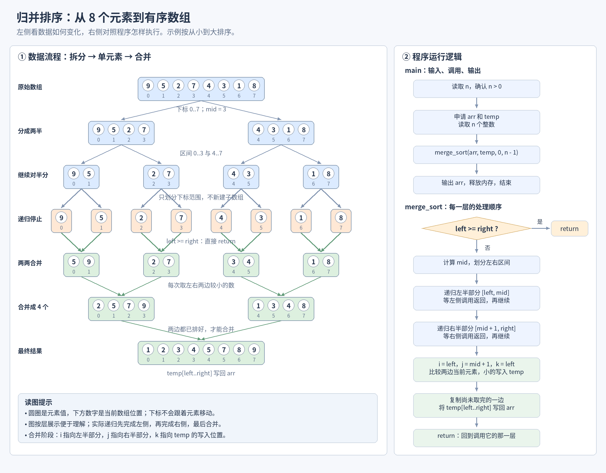

# P1177：归并排序学习笔记

本程序读取 `n` 个整数，用递归归并排序将它们按从小到大排列，再输出排序结果。算法的标准名称是“归并排序”。

这份笔记以当前的 [P1177_submit.c](P1177_submit.c) 为准，重点解释数组怎样变化、递归怎样返回，以及合并时的下标为什么这样写。

## 文件说明

| 文件 | 用途 |
| --- | --- |
| [P1177.c](P1177.c) | 带学习注释的实现 |
| [P1177_submit.c](P1177_submit.c) | 无注释的提交版本 |
| [p1177_gpt_ver.c](p1177_gpt_ver.c) | 之前保留的参考版本 |
| [docs/merge-sort-guide.png](Figures_图解资料/merge-sort-guide.png) | 左侧数组流程、右侧程序运行逻辑的示例图 |
| [docs/draw_merge_sort.py](Figures_图解资料/draw_merge_sort.py) | 绘图源文件，可使用 Pillow 重新生成图片 |

## 示例图：8 个元素怎样排好序



可以点击图片打开原图，放大查看注释。蓝色表示拆分，橙色表示单元素的递归终点，绿色表示合并后的有序区间。

示例输入：

```text
8
9 5 2 7 4 3 1 8
```

示例输出：

```text
1 2 3 4 5 7 8 9
```

圆圈中的数字是**元素值**，下面的数字是**当前数组下标**。例如，排序后 `1` 位于下标 `0`，下标不会跟着原来的元素一起移动。

图中按层展示所有区间，是为了方便观察；程序实际执行时，先完成左半部分，再完成右半部分，最后合并当前区间。

## 一、整体思路：先拆小，再合并

归并排序依赖一个事实：**两个已经有序的数组区间，可以通过依次取较小元素，合并成一个有序区间。**

但是原数组还没有排好，所以先把问题拆小：

1. 把当前区间分成左右两半。
2. 用同样的方法排好左半部分。
3. 用同样的方法排好右半部分。
4. 合并两部分，得到当前区间的有序结果。

只有一个元素时，不需要任何操作就已经有序。这就是递归能够结束的原因。

本程序的“拆分”只是改变 `left、mid、right` 这些下标范围，**没有实际创建左右两个新数组**。所有递归调用使用同一份 `arr` 和同一份 `temp`。

## 二、main 的工作

`main` 负责准备数据和展示结果，排序工作由 `merge_sort` 完成。

| 顺序 | 当前代码的工作 | 目的 |
| --- | --- | --- |
| 1 | 读取 `n`，检查读取成功且 `n > 0` | 得到元素数量；不合法时直接结束 |
| 2 | 用 `malloc` 申请 `arr` 和 `temp` | `arr` 保存数据；`temp` 暂存合并结果 |
| 3 | 检查申请是否成功 | 失败时释放已申请的内存并退出 |
| 4 | 读取 `n` 个整数到 `arr` | 准备待排序的数据；读取失败时释放内存并退出 |
| 5 | 调用 `merge_sort(arr, temp, 0, n - 1)` | 排序整个数组 |
| 6 | 输出 `arr` 中的全部元素 | 展示最终结果 |
| 7 | `free(arr)`、`free(temp)` | 释放动态申请的内存 |

当前输出在每个数字后打印一个空格，没有额外的说明文字。

`malloc((size_t)n * sizeof *arr)` 的含义是申请足够存放 `n` 个 `int` 的字节数。数组在堆上申请，避免把大量数据放进局部数组而占用过多栈空间。

## 三、merge_sort 的参数与边界

```c
void merge_sort(int arr[], int temp[], int left, int right)
```

| 参数 | 含义 |
| --- | --- |
| `arr` | 原数组，也是最终结果所在的数组 |
| `temp` | 临时数组，用来保存本次合并结果 |
| `left` | 当前区间第一个元素的下标 |
| `right` | 当前区间最后一个元素的下标 |

本实现使用**闭区间** `[left, right]`，左右端点都包含在内。区间长度为 `right - left + 1`。

对于示例数组，第一次调用是：

```c
merge_sort(arr, temp, 0, 7);
```

中点计算为：

```c
int mid = left + (right - left) / 2;
```

当 `left = 0、right = 7` 时，`mid = 3`。左半部分是 `[0, 3]`，右半部分是 `[4, 7]`，两者没有重叠，也没有遗漏。

## 四、递归调用究竟怎样执行

```c
if (left >= right) {
    return;
}

int mid = left + (right - left) / 2;
merge_sort(arr, temp, left, mid);
merge_sort(arr, temp, mid + 1, right);
```

调用左侧递归时，当前这一层会等待它执行完。左侧返回后，才执行右侧递归；右侧返回后，才执行当前层的合并代码。

以最左边两个数 `[9, 5]` 为例：

```text
merge_sort(0, 1)
    调用 merge_sort(0, 0) → 只有 9，直接返回
    调用 merge_sort(1, 1) → 只有 5，直接返回
    合并 [9] 和 [5] → 得到 [5, 9]
    把 [5, 9] 写回 arr[0..1]
    返回上一层
```

这里省略了 `arr、temp` 参数，只展示下标。

**子调用中的 `return` 只结束那个子调用，程序会回到调用它的位置继续执行，不会结束整个排序。** 每次调用都有自己的 `left、right、mid、i、j、k`，但它们共用原数组和临时数组。

## 五、合并时 i、j、k 各管什么

```c
int i = left;
int j = mid + 1;
int k = left;
```

| 变量 | 起点 | 含义 | 有效范围 |
| --- | --- | --- | --- |
| `i` | `left` | 左半部分下一个待取元素的位置 | `left..mid` |
| `j` | `mid + 1` | 右半部分下一个待取元素的位置 | `mid + 1..right` |
| `k` | `left` | 临时数组下一个写入位置 | `left..right` |

`i` 不是“整个数组的标志”，`k` 也不是“左边数组的标志”。它们分别负责左侧读取和临时数组写入。

合并核心代码，附逐步注释：

```c
// 只有左右两边都还有元素时，才进行比较。
while (i <= mid && j <= right) {
    if (arr[i] <= arr[j]) {
        // 左侧元素更小或相等：取左侧元素。
        temp[k++] = arr[i++];
    } else {
        // 右侧元素更小：取右侧元素。
        temp[k++] = arr[j++];
    }
}

// 比较结束后，可能还有一边没有取完。
// 剩余元素本来就有序，直接依次复制即可。
while (i <= mid) {
    temp[k++] = arr[i++];
}
while (j <= right) {
    temp[k++] = arr[j++];
}

// 合并结果目前在 temp 中，必须写回 arr。
// right 也属于当前区间，不能漏掉。
for (int p = left; p <= right; p++) {
    arr[p] = temp[p];
}
```

其中：

```c
temp[k++] = arr[i++];
```

可以拆开理解为：

```c
temp[k] = arr[i];
k++;
i++;
```

这里的 `++` 是移动下标，不是继续递归；真正的递归发生在前面的 `merge_sort(...)` 调用中。

### 最后一轮合并的逐步演示

此时左右两半已经分别有序：

```text
左半部分：2 5 7 9    （arr[0..3]）
右半部分：1 3 4 8    （arr[4..7]）
```

初始 `i = 0、j = 4、k = 0`：

| 步骤 | 比较或操作 | 写入 temp 的值 | temp 中已经写好的部分 |
| --- | --- | --- | --- |
| 1 | 比较 2 和 1，取右侧 | 1 | `1` |
| 2 | 比较 2 和 3，取左侧 | 2 | `1 2` |
| 3 | 比较 5 和 3，取右侧 | 3 | `1 2 3` |
| 4 | 比较 5 和 4，取右侧 | 4 | `1 2 3 4` |
| 5 | 比较 5 和 8，取左侧 | 5 | `1 2 3 4 5` |
| 6 | 比较 7 和 8，取左侧 | 7 | `1 2 3 4 5 7` |
| 7 | 比较 9 和 8，取右侧 | 8 | `1 2 3 4 5 7 8` |
| 8 | 右侧取完，复制左侧剩下的 9 | 9 | `1 2 3 4 5 7 8 9` |

最后把 `temp[0..7]` 写回 `arr[0..7]`，整个排序才算完成。

## 六、之前两处边界错误为什么影响结果

### 1. 比较循环必须包含 mid

正确写法：

```c
while (i <= mid && j <= right)
```

若写成 `i < mid`，会漏掉左侧最后一个元素。只有两个数时，`left = mid = 0`，条件 `0 < 0` 一开始就不成立，比较完全不会执行。

### 2. 写回循环必须包含 right

正确写法：

```c
for (int p = left; p <= right; p++)
```

若写成 `p < right`，临时数组最后一个位置不会写回原数组，即使 `temp` 已经排好，`arr` 也可能仍然错误。

这些错误属于逻辑错误，编译器仍然可能成功编译。**编译成功只说明代码能生成程序，不代表排序结果一定正确。**

## 七、复杂度与稳定性

| 项目 | 当前实现 |
| --- | --- |
| 最好、平均、最坏时间复杂度 | 都是 `O(n log n)` |
| 临时数组空间 | `O(n)` |
| 递归调用栈空间 | `O(log n)` |
| 总额外空间复杂度 | `O(n)` |
| 稳定性 | 稳定：相等时优先取左边元素 |

每次对半分，递归深度约为 `log₂n`；每一层所有区间的合并工作加起来是 `O(n)`，因此总时间是 `O(n log n)`。

图中的 8 个元素有 3 轮合并：`1 → 2 → 4 → 8`。这 3 轮每轮总共处理 8 个元素。冒泡排序需要大量相邻比较，时间为 `O(n²)`，大数据下更容易超时。

## 八、本地编译、运行与提交

在当前文件夹的终端中执行：

```bash
gcc -std=c99 -Wall -Wextra -O2 P1177_submit.c -o P1177_submit
./P1177_submit
```

运行后输入上面的示例，程序会输出升序结果。也可以直接测试：

```bash
printf '8\n9 5 2 7 4 3 1 8\n' | ./P1177_submit
```

当前文件是 C 代码。提交时应选择 C 语言；平台的 C/C++ 编译环境说明可参考 [洛谷帮助中心](https://help.luogu.com.cn/manual/luogu/problem/judging)。

如果选择 C++，当前这两行会因为 `void *` 无法隐式转换成 `int *` 而报错：

```c
int *arr = malloc((size_t)n * sizeof *arr);
int *temp = malloc((size_t)n * sizeof *temp);
```

需要兼容 C++ 时，可改为显式转换：

```c
int *arr = (int *)malloc((size_t)n * sizeof *arr);
int *temp = (int *)malloc((size_t)n * sizeof *temp);
```

正常的注释不影响编译。复制代码时应保留换行，避免 `//` 注释后面的下一行被拼到同一行中。提交版本已经移除了注释。

## 九、建议怎样练习

先手算 `[9, 5]`，再手算 `[9, 5, 2, 7]`，最后回到图中的 8 个元素。每次合并都写出 `i、j、k` 的初值，并记录每次取数后哪个下标增加。

你能回答下面三个问题，就抓住了本实现的核心：

1. 为什么执行合并之前，左右两半已经有序？
2. 为什么一边取完后，另一边可以直接复制？
3. 为什么排好 temp 后，还必须写回 arr？
